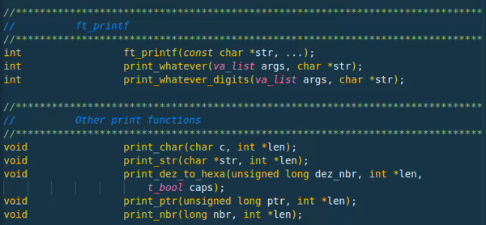

<!-- ahokcool HEADER START-->
---
<a id="top"></a>
<div align="center">
  <a href="https://github.com/ahokcool/ahokcool/blob/main/README.md">
    
  </a><br>
  An overview of all my projects can be found here: <a href="https://github.com/ahokcool/ahokcool/blob/main/README.md" target="_blank">ahokcool</a><br><br>
  <a href="https://www.42lisboa.com">
    
  </a><br>
  This project was created as part of my studies at: <a href="https://www.42lisboa.com" target="_blank">42 Lisboa</a><br>
</div>

---
<!-- ahokcool HEADER END-->
<!-- PROJECT HEADER START -->
<br />
<div align="center">
  <a href="./">
    
  </a>
  <h1 align="center">libft-gnl-printf</h1>
</div>
<br>
<!-- PROJECT HEADER END -->

In this repository, I have strategically merged the three foundational 42 projects:
- libft
- get_next_line (gnl)
- ft_printf

This integration aims to leverage the strengths of these projects, which are designed to be used together for various C programming tasks. I use this repo in the following projects:
- [fdf](https://github.com/ahokcool/fdf)
- [push_swap](https://github.com/ahokcool/push_swap)
- [minitalk](https://github.com/ahokcool/minitalk)
- [minishell](https://github.com/ahokcool/frankenshell)
- [cub3D](https://github.com/ahokcool/cub3D)

---

### libft
- A collection of C functions that are often used in various 42 projects.
- Functions include a mix of standard C library functions and additional utility functions.

---

### get next line
- Efficiently reads a line from a file or standard input until a newline character is encountered.
- Handles multiple file descriptors simultaneously.

---

### ft_printf
- Replicates (parts of) the ```printf``` function from the standard C library ```libc```.

<!-- ahokcool FOOTER-->
---
<p align="center">
  <a href="#top">🔝 back to top 🔝</a>
</p>
